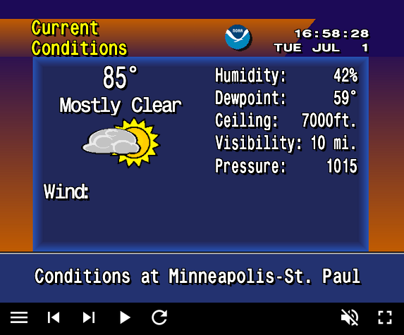

# WeatherStar

This project brings back the weather of the 90's, based on the Weather Channel's WeatherStar 4000 hardware system. It makes use of the [National Weather Service's API](https://www.weather.gov/documentation/services-web-api) to get the forecast for your area. There's also a couple improvements compared to the original TWC system, including some better graphs and time-stamping, and more useful SPC outlooks.

This project is based on the WS4000+ project by Matt Walsh, which you can find [here](https://github.com/netbymatt/ws4kp). My version has diverged drastically, as I find that project to be unbelievably overengineered. The primary difference is that this version doesn't require a complicated build system with random libraries loading in. I've also added some missing icons, and an icon derivation algorithm to compensate for the NOAA API having deprecated its icon response field. Initial loading time is also improved by about 10x versus the original fork.

I've also added an in-memory caching system for images, since the ws4kp image preloading doesn't really work when running for hours or days at a time. The cache provides immediate access to frequently used images during app loops and relies on browser caching for persistence. For debugging you can enable monitoring and a basic set of tests with `window.cacheMonitor()`.

## Acknowledgments

This project was initially forked from [WS4000+ (ws4kp)](https://github.com/netbymatt/ws4kp) by Matt Walsh. While this version has been significantly restructured and simplified, it relies heavily on the original graphics and visual assets created by Michael Battaglia. This fork primarily simplifies the code, including removing the complex build system and mess of dependencies, adds image caching, and adds some more screens. It also removed most of the configurability of Matt Walsh's version.

## Disclaimer

This application is for entertainment and educational purposes only. It is NOT intended for use in life-threatening weather conditions or emergency situations, or be relied on to inform the public of such situations. Do not rely on this application for critical weather decisions. Always consult official weather services and emergency broadcasts during severe weather. This application may not provide real-time or accurate weather information. Use official weather apps and services for safety-critical decisions. The authors of this code and of [weather.jmthornton.net](https://weather.jmthornton.net) shall not be held liable in the event of injury, death or property damage that occur as a result of disregarding this warning. See the included [license](./LICENSE) for specific language limiting liability (it's the ISC license).
